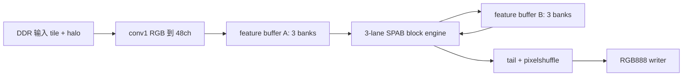

# W8A12 三路并行架构主线

本文档定义 `W8A12_3lane` 新主线的硬件架构边界。旧工程只作为只读参考、权重来源和上板基础设施来源；新实现以三路 output-channel 并行为核心重新建立验证闭环。

## 1. 目标

- 模型语义保持不变：REDS SPAN x4，W8A12，48 feature channels，6 个 SPAB block。
- 并行方式改变：一个 SPAB block 内按 output channel 分成 3 路并行，每路 16 个输出通道。
- block 调度保持不变：`block_1` 到 `block_6` 串行推进。
- 第一验收目标：`32x32 LR tile + halo=21 -> x4 -> 128x128 RGB`，与 Python W8A12 fixed-point reference bit-exact。
- 资源评估按 ZC706 / XC7Z045 门限汇报，同时本地可使用 `xczu19eg-ffvc1760-2-i` 上板。

## 2. 顶层数据流

```text
PS/XSCT 写 DDR 输入
  -> DDR tile + halo reader
  -> conv1: RGB -> 48ch feature
  -> 3-bank feature buffer A
  -> block_1..block_6:
       3-lane SPAB block engine
       3-bank feature buffer ping-pong
  -> tail / reconstruct / pixelshuffle x4
  -> RGB888 output writer
  -> DDR 输出区
```



## 3. Lane 定义

三路并行按输出通道划分：

```text
lane0: output channels  0..15
lane1: output channels 16..31
lane2: output channels 32..47
```

每个 lane 都读取完整的 48 输入通道和 3x3 window，只负责自己的 16 个输出通道。这样不会引入 partial-sum 合并，也不会改变 W8A12 累加、舍入和饱和规则。

MAC/DSP 映射策略见 `docs/mac_dsp_mapping_policy.md`：主线使用可综合 RTL MAC 并由 Vivado 映射到 DSP48，只有在 OOC 证明推断不稳定时才启用 DSP48E1/E2 primitive wrapper。

## 4. Feature Bank 定义

feature buffer 固定按 3 个 bank 组织：

```text
bank0: channels  0..15
bank1: channels 16..31
bank2: channels 32..47
```

写回时 lane0 写 bank0，lane1 写 bank1，lane2 写 bank2。读 window 时三个 bank 同时供数，拼成完整 48 通道输入。block 之间使用 ping-pong buffer，避免读写同一 bank 的结构冲突。

## 5. SPAB Block 内部顺序

单个 SPAB block 的顺序固定为：

```text
input feature
  -> c1_r 3-lane conv
  -> act1 LUT
  -> c2_r 3-lane conv
  -> act2 LUT
  -> c3_r 3-lane conv
  -> attention LUT
  -> attention(out3, residual, sim_att)
  -> block output
```

当前 A1 证据已经证明 `block_1` 的上述顺序可以在三路 output-channel 并行下与 Python reference bit-exact。

## 6. 分层验收

| 阶段 | 验收对象 | 通过标准 |
| --- | --- | --- |
| A0 | 单层 3-lane conv | 48ch 输出拼接后与 Python layer reference bit-exact |
| A1 | 单个 SPAB block | C1/C2/C3/LUT/attention 全部与 Python reference bit-exact |
| A2 | 6 个 SPAB block | block_1..block_6 边界 hash 全部一致 |
| A3 | tail/pixelshuffle/RGB | tile RGB 输出与 Python fixed-point reference bit-exact |
| A4 | OOC/resource/timing | 资源低于 XC7Z045 门限，时序满足目标频率 |
| A5 | 32x32 上板 | board 输出与 fixed-point reference bit-exact |
| A6 | 64x64 上板 | board 输出正确，吞吐和带宽可量化 |
| A7 | 720p 输出 | 给出 FPS、latency、power、PSNR/SSIM 和资源汇报 |

## 7. 当前边界

当前新主线已完成 A0 和 A1 的 reference 与 RTL 仿真；A2 已完成六个 SPAB block 的 Python fixed-point reference、边界 hash 和 4x4 feature frame 的 RTL 语义仿真；A3 已完成 Python fixed-point tail/pixelshuffle/RGB reference 和 RTL 语义仿真。尚未完成的交付项是可综合 A2 tile scheduler、A3 board writer 对齐、A4 资源时序、A5-A7 上板和赛题报告材料。
